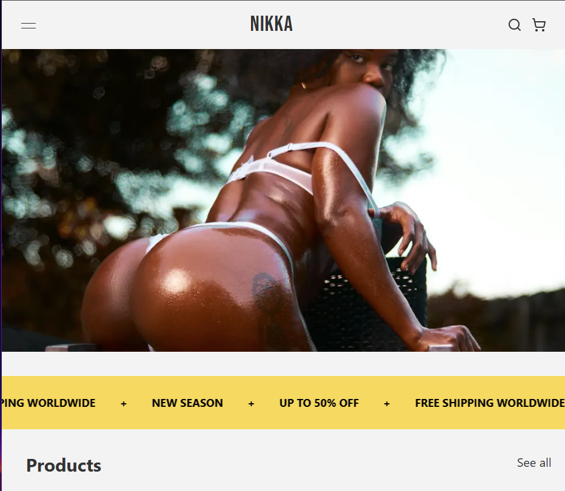
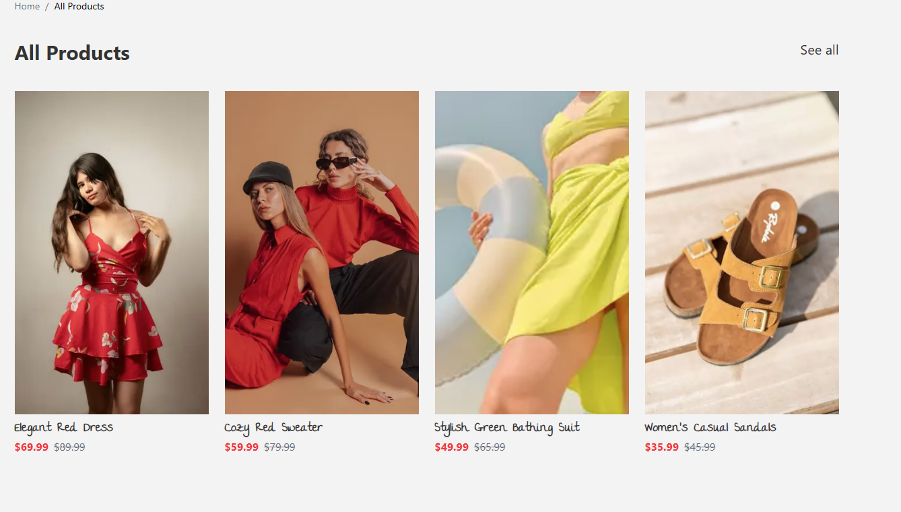

# NIIKA — Fashion E-Commerce Platform

> A modern, full-stack fashion e-commerce store built with Next.js, featuring curated collections, seamless authentication, and a sleek shopping experience.

---

## 📸 Screenshots

### Homepage



### All Products



---

## ✨ Features

- **Product Catalog** — Browse all products with sale pricing displayed prominently
- **Authentication** — Secure sign-up/sign-in powered by Better Auth
- **Shopping Cart** — Add to cart and checkout flow
- **Free Shipping Worldwide** — Promotions displayed via animated banner
- **Sales & Discounts** — Up to 50% off with clear original vs. sale price display
- **Vercel Deployment** — Fast, globally distributed via Vercel CDN
- **Responsive Design** — Mobile-first layout with Tailwind CSS

---

## My Tech Stack

| Technology                                    | Purpose                      |
| --------------------------------------------- | ---------------------------- |
| [Next.js](https://nextjs.org/)                | React framework (App Router) |
| [TypeScript](https://www.typescriptlang.org/) | Type safety                  |
| [Tailwind CSS](https://tailwindcss.com/)      | Utility-first styling        |
| [Better Auth](https://better-auth.com/)       | Authentication               |
| [Vercel](https://vercel.com/)                 | Deployment & hosting         |

---

## Getting Started

### Prerequisites

- Node.js 18+
- npm / yarn / pnpm

### Installation

```bash
# Clone the repository
git clone https://github.com/dekema9924/Niika-Eccomerce-
cd niika

# Install dependencies
npm install
```

### Environment Variables

Create a `.env.local` file in the root directory:

```env
# Better Auth
BETTER_AUTH_SECRET=your_secret_here
BETTER_AUTH_URL=http://localhost:3000

# Database
DATABASE_URL=your_database_url_here
```

### Development

```bash
npm run dev
```

Open [http://localhost:3000](http://localhost:3000) in your browser.

### Build

```bash
npm run build
npm start
```

---

## 📁 Project Structure

```
niika/
├── app/
│   ├── (auth)/
│   │   ├── login/
│   │   └── register/
│   ├── products/
│   ├── cart/
│   └── layout.tsx
├── components/
│   ├── ui/
│   ├── ProductCard.tsx
│   ├── Navbar.tsx
│   └── Banner.tsx
├── lib/
│   └── auth.ts
├── public/
├── tailwind.config.ts
└── next.config.ts
```

---

## 🌐 Deployment

This project is deployed on **Vercel**. Every push to `main` triggers an automatic deployment.

[](https://vercel.com/new/clone?repository-url=https://github.com/your-username/niika)

---

## 📄 License

MIT © NIIKA
